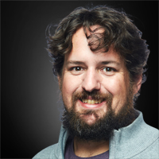

Organizers
++++++++++

Workshop Chairs
===============

Pete Mendygral (Hewlett Packard Enterprise)
-------------------------------------------

.. figure:: images/pete.mendygral.png
   :align: left
   :scale: 15 %

Pete Mendygral is a Distinguished Technologist in the HPC&AI organization at HPE where he works on
distributed runtimes and other technologies focused on productivity and efficiency for complex workflows. He
is the technical lead and architect for the DragonHPC project and is passionate about helping researchers and communities
succeed. Pete received a PhD in astrophysics from the University of Minnesota in 2011, where he developed HPC
applications to study outflows from supermassive blackholes.

|

|

Sunita Chandrasekaran (University of Delaware)
----------------------------------------------

.. figure:: images/sunita.jpg
   :align: left
   :scale: 20 %

Sunita Chandrasekaran is an Associate Professor with the Department of Computer and Information Sciences and co-directs
the AI center of Excellence at the University of Delaware, USA. Her research spans HPC, compilers, exascale computing,
benchmarking, machine learning and AI. Her research is also heavily interdisciplinary spanning plasma physics, biophysics,
solar physics and bioinformatics. She received her Ph.D. on Tools and Algorithms for High-Level Algorithm Mapping to FPGAs
from Nanyang Technological University, Singapore. She is a recipient of the 2016 IEEE-CS TCHPC Award for Excellence for
Early Career Researchers in High Performance Computing. She has held various leadership positions in HPC conferences
and workshops over the past several years.

|

Sam Foreman (Argonne National Labs)
-----------------------------------

.. figure:: images/sf_headshot_iowa.jpeg
   :align: left
   :scale: 35 %

Sam Foreman is a computational scientist with a background in high energy physics at the ALCF.
He is generally interested in the application of machine learning to computational problems in physics, particularly
within the context of high performance computing. Sam's current research focuses on using deep generative modeling to
help build better sampling algorithms for simulations in lattice gauge theory.

|

|

Daniel Margala (National Energy Research Scientific Computing Center)
---------------------------------------------------------------------

.. figure:: images/Daniel-480__ScaleHeightWzE1MF0.jpg
   :align: left
   :scale: 100 %

Daniel Margala is a Scientific Data Architect in the Programming Environments and Models group at NERSC. Previously,
he was a NERSC Exascale Science Application Program (NESAP) postdoctoral fellow at Lawrence Berkeley National Laboratory
working with the Dark Energy Spectroscopic Instrument (DESI) data processing team, focusing on high performance
computing with GPUs using Python. Daniel has a PhD in Physics from the University of California, Irvine and a BS in
Physics from the University of California, Los Angeles.

|

Davin Potts (Appliomics)
------------------------

.. figure:: images/davin_potts.png
   :align: left
   :Scale: 35%

Davin Potts currently runs Appliomics, LLC, a scientific software consultancy based in Austin. Davin's formal education
is in Theoretical Chemistry but professional development led to his becoming a CPython Core Committer. He was previously
a founder of Myria, a Y Combinator funded luxury services marketplace startup, co-founder of KNIME, a Zurich-based data
mining and visualization startup, Chief Data Scientist at Continuum Analytics, an Austin-based Python language solutions
startup, and Chief Science Officer at Stipple, a San Francisco-based image monetization startup. Davin holds 3 patents
in the fields of bioinformatics, computer vision, machine learning, and edge computing.

|

Andy Terrel (NVIDIA)
------------------------

Andy Terrel leads NVIDIA CUDA Python from the product management team. His research focused on domain-specific languages
to generate high-performance code for physics simulations with the PETSc and FEniCS projects. Andy is a leader in the
Python open-source software community. He's most notably a co-creator of the Dask distributed computing framework, the
Conda package manager, the SymPy symbolic computing library, and NumFOCUS foundation.

|

|
Technical Program Committee
===========================

Coming soon

..
   * Eric Eilertson (Microsoft)
   * Bjoern Enders (National Energy Research Scientific Computing Center)
   * Fernanda Foertter (Voltron Data)
   * Khalid Hossain (Argonne National Labs)
   * Sreenivas Rangan Sukumar (Hewlett Packard Enterprise)
