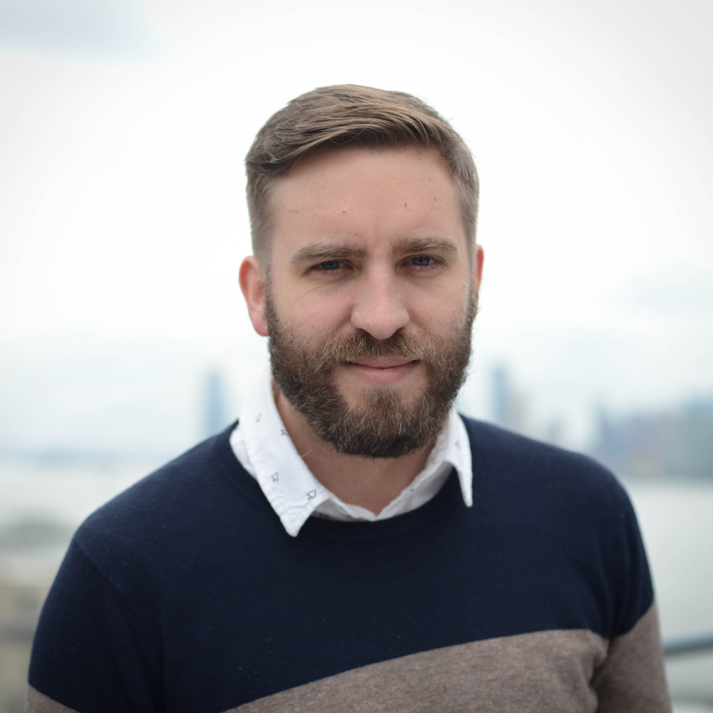

Workshop Schedule
+++++++++++++++++

.. |SC25Sched| raw:: html

   <a href="https://sc25.conference-program.com/session/?sess=sess231" target="_blank">Link to SC25 HPPSS Schedule</a>

Ryan Abernathey (Earthmover) - Featured Speaker
===============================================

Ryan P. Abernathey is a scientist, startup founder, and open-source software developer. He is the CEO and co-founder of Earthmover PBC, a startup on a mission to empower people to use scientific data to solve humanity's greatest challenges. Until 2024, he was an Associate Professor of Earth And Environmental Science at Columbia University and Lamont Doherty Earth Observatory. As a physical oceanographer, he has studied the large-scale ocean circulation and its relationship with Earth's climate using climate models and satellite data. He received his Ph.D. from MIT in 2012 and did a postdoc at Scripps Institution of Oceanography. He has received an Alfred P. Sloan Research Fellowship in Ocean Sciences, an NSF CAREER award, The Oceanography Society Early Career Award, and the AGU Falkenberg Award. He was a member of the NASA Surface Water and Ocean Topography (SWOT) science team and Director of Data and Computing for a new NSF Science and Technology Center called Learning the Earth with Artificial Intelligence and Physics (LEAP). Dr. Abernathey is an active participant in and advocate for open source software, open data, and reproducible science. In 2016 he helped found the Pangeo project, an open science community focused on big scientific data analytics.

|

|

Rafael Ferreira Da Silva (ORNL) - Invited Speaker
=================================================

.. |RDS| raw:: html

   <a href="https://rafaelsilva.com" target="_blank">https://rafaelsilva.com</a>

.. figure:: images/b2026-rafael-ferriera-da-silva.jpeg
   :align: left
   :scale: 90 %

Rafael Ferreira da Silva is a Distinguished Research Scientist and the Section Head for Data and AI Systems (DAIS) section in the Computer Science and Mathematics division (CSMD), leading research and development in AI, data and agentic workflows, and advanced computing systems. Dr. Ferreira da Silva's research focuses on workflow benchmarking on distributed computing platforms, hybrid quantum-classical workflows, and autonomous laboratory systems. He has extensive experience leading/working on large-scale projects related to distributed computing platforms, cyberinfrastructure systems, and applications. Notably, he is a co-founder and the Executive Director of the Workflows Community Initiative. He also brings substantial experience on community engagement and workshop organization. He was PI on a number of DOE- and NSF-funded projects, and his scholarly work includes more than 160 peer-reviewed journal articles, conference proceedings articles, book chapters, editorials, and conference abstracts. His achievements and expertise are further highlighted by his status as a Senior Member of the IEEE and ACM. For more information about his work and contributions, please visit |RDS| .
